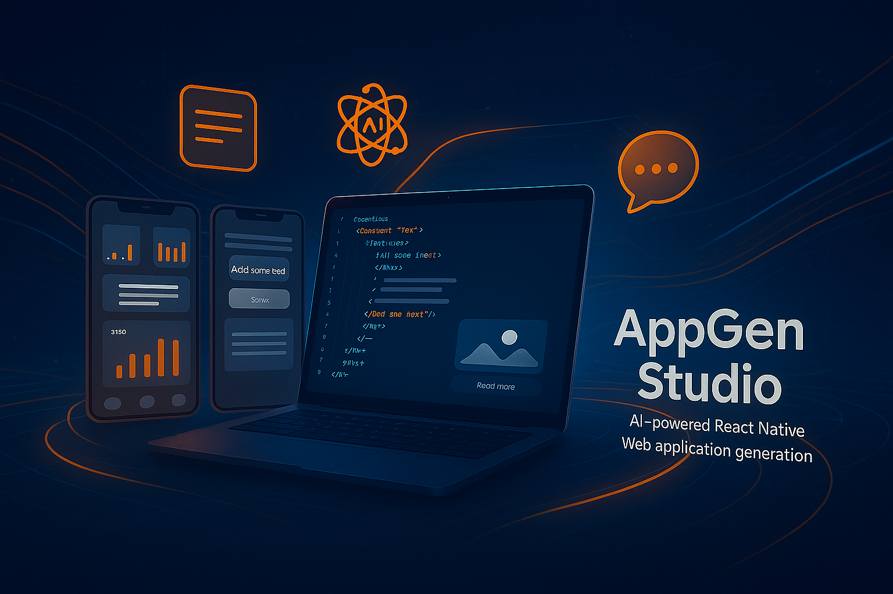
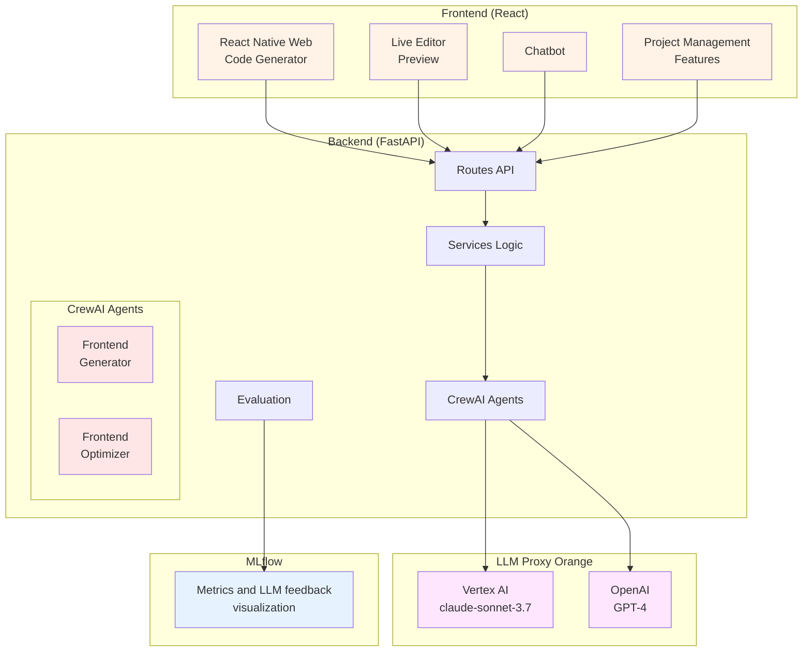

# AppGen Studio - AI-Powered React Native Web Generator

<div align="center">


*Create production-ready React Native Web applications with AI-powered generation and real-time modifications*

[](https://reactjs.org/)
[](https://fastapi.tiangolo.com/)
[](https://crewai.com/)
[](https://mlflow.org/)
[](https://python-poetry.org/)

[🚀 Quick Start](#-quick-start) • [📖 Documentation](#-documentation) • [🎯 Features](#-features) • [🏗️ Architecture](#-architecture)

</div>

---

## 🌟 Overview

AppGen Studio is a comprehensive full-stack application that revolutionizes React Native Web development through AI-powered code generation. Built with modern technologies, it provides developers with an intelligent assistant that can generate, modify, and optimize React applications in real-time.

### ✨ Key Highlights

- **🤖 AI-Powered Generation**: Generate complete React Native Web applications from natural language descriptions
- **💬 Conversational Modifications**: Modify your projects through natural language chat with specialized AI agents
- **📊 Quality Assurance**: Automated evaluation system with MLflow tracking for consistent quality
- **🎨 Modern UI**: Beautiful Orange Boosted design system with real-time code preview
- **📁 File Intelligence**: PDF processing and context-aware file uploads for enhanced generation
- **🌐 Multilanguage Support**: Full internationalization with French, English, and Spanish support

---

## 🎯 Features

### 🎨 Frontend Capabilities
- **Live Code Editor**: Integrated Sandpack editor with real-time preview
- **Chat Interface**: Conversational AI assistant with auto-rotating suggestions
- **File Management**: Drag-and-drop uploads with PDF text extraction
- **Project Export**: Multiple formats (JSON, ZIP) with proper file structure
- **Responsive Design**: Mobile-first Orange Boosted UI with accessibility support
- **Language Switching**: Dynamic language switching with persistent preferences (FR, EN, ES)

### 🔧 Backend Power
- **Multi-Agent System**: Specialized AI agents for generation and modification tasks
- **LLM Support**: Compatible with Claude, OpenAI GPT, and Azure GitHub Models
- **Quality Evaluation**: Automated scoring with weighted criteria (Requirements: 50%, Code Quality: 25%, RNW Compliance: 25%)
- **Experiment Tracking**: Comprehensive MLflow integration for performance monitoring
- **PDF Processing**: Extract text from PDFs for enhanced context understanding

---

## 🚀 Quick Start

### What You Need
- **Node.js** 16+ 
- **Python** 3.11+
- **Docker** (easiest option)
- **Your LLM API Key** (Claude, OpenAI, etc.)

---

## 🏃‍♂️ Easy Setup (2 Minutes)

### 1️⃣ Get the Code
```bash
git clone <repository-url>
cd AppGen-Studio
```

### 2️⃣ Add Your API Key
```bash
cd backend
echo "API_KEY=your_actual_api_key_here" > .env
echo "BASE_URL=your_llm_base_url" >> .env
```

### 3️⃣ Run Everything
```bash
# Go back to main folder
cd ..

# Start everything with Docker (easiest!)
docker-compose up --build
```

**That's it! 🎉**

Open your browser:
- **App**: http://localhost:3000
- **API**: http://localhost:8000/docs
- **Analytics**: http://localhost:5000

---

## 🛠️ Alternative: Run Without Docker

**If you don't want to use Docker:**

### Backend (Terminal 1)

**With Poetry (recommended):**
```bash
cd backend
# Install Poetry if you don't have it
curl -sSL https://install.python-poetry.org | python3 -
poetry install
poetry run uvicorn app.main:app --reload
```

**Or with pip:**
```bash
cd backend
pip install -r requirements.txt
uvicorn app.main:app --reload
```

### Frontend (Terminal 2)
```bash
cd frontend
npm install
npm start
```

### Analytics - Optional (Terminal 3)
```bash
# With Poetry
cd backend && poetry run mlflow server --port 5000

# Or with pip
pip install mlflow && mlflow server --port 5000
```

---

## 🏗️ Architecture



### 🧩 Technology Stack

#### Frontend
| Technology | Purpose | Version |
|------------|---------|---------|
| **React** | UI Framework | 18+ |
| **Orange Boosted** | Design System | Latest |
| **Sandpack** | Code Editor | Latest |
| **Lucide React** | Icons | Latest |

#### Backend
| Technology | Purpose | Version |
|------------|---------|---------|
| **FastAPI** | Web Framework | Latest |
| **CrewAI** | AI Orchestration | Latest |
| **MLflow** | Experiment Tracking | Latest |
| **PyPDF2** | PDF Processing | Latest |
| **Poetry** | Dependency Management | Latest |

#### AI & ML
| Provider | Model | Usage |
|----------|-------|-------|
| **Vertex AI** | Claude Sonnet 3.7 | Primary Generation |
| **OpenAI** | GPT-4 | Alternative LLM |
| **Azure** | GitHub Models | Enterprise Option |

---

## 📖 Usage Guide

### 🎨 Generate Your First Project

1. **Navigate to Generator**
   ```
   ├── Describe your project: "Todo app with dark mode"
   ├── Add features: "Drag & drop, local storage, categories"
   ├── Upload files: Drag PDFs or code files for context
   └── Click "Generate Project"
   ```

2. **Real-time Preview**
   - Switch to "Preview" tab
   - See live code editor with your generated project
   - Make manual edits or use AI chat

3. **AI-Powered Modifications**
   ```
   💬 Chat: "Change the primary color to orange"
   💬 Chat: "Add a hamburger menu to the header"
   💬 Chat: "Implement user authentication"
   ```

### 📊 Quality Monitoring

AppGen Studio automatically evaluates every generated project:

- **Requirements Fulfillment** (50%): How well the project matches your description
- **Code Quality** (25%): Clean architecture, best practices, error handling
- **React Native Web Compliance** (25%): Proper RNW usage and responsiveness

View detailed metrics in the MLflow dashboard at http://localhost:5000

---

## 🔌 API Reference

### Core Endpoints

#### Project Generation
```http
POST /generate-project
Content-Type: application/json

{
  "description": "E-commerce shopping cart with filters",
  "features": "User auth, payment integration, mobile responsive"
}
```

#### Chat Modifications
```http
POST /api/chat/chat/{project_id}
Content-Type: application/json

{
  "message": "Add a sidebar navigation with collapsible menu"
}
```

#### PDF Processing
```http
POST /api/pdf/extract-pdf-text
Content-Type: multipart/form-data

file: specification.pdf
```

#### Evaluation
```http
POST /api/evaluation/evaluate
Content-Type: application/json

{
  "use_default_cases": true,
  "test_cases": [...]
}
```

---

## 🛠️ Advanced Configuration

### Environment Variables

```bash
# Required
API_KEY=your_llm_api_key
BASE_URL=your_llm_base_url

# Optional
GITHUB_TOKEN=github_token_for_models
MLFLOW_TRACKING_URI=http://localhost:5000
```

### Production Docker Deployment

```bash
# Production with custom environment
docker-compose -f docker-compose.yml -f docker-compose.prod.yml up -d

# Scale services
docker-compose up --scale backend=3

# View resource usage
docker stats
```

---

## 📊 Monitoring & Analytics

### MLflow Dashboard Features
- **Experiment Tracking**: All project generations with metadata
- **Performance Metrics**: Success rates, response times, quality scores
- **Model Comparison**: Compare different LLM providers
- **Artifact Storage**: Generated projects and evaluation reports

### Built-in Analytics
- **Token Usage Tracking**: Monitor LLM costs in `token_usage.log`
- **User Interaction Metrics**: Chat frequency, modification success rates
- **File Upload Analytics**: Success rates by file type and size

---

## 🐛 Something Not Working?

**App won't start?**
- Check if your API key is correct in `backend/.env`
- Make sure ports 3000, 8000, 5000 aren't being used by other apps

**Docker problems?**
```bash
docker-compose down
docker-compose up --build
```

**Without Docker problems?**
- Press `Ctrl+C` to stop all terminals
- Try the commands again

**Still stuck?** 
- Check if Node.js and Python are installed correctly
- Make sure your API key works with your LLM provider

---

## 🤝 Contributing

We welcome contributions! Please follow these guidelines:

1. **Fork** the repository
2. **Create** a feature branch: `git checkout -b feature/amazing-feature`
3. **Commit** your changes: `git commit -m 'Add amazing feature'`
4. **Push** to branch: `git push origin feature/amazing-feature`
5. **Open** a Pull Request

### Development Setup
```bash
# Install pre-commit hooks (using Poetry)
cd backend
poetry install --with dev
poetry run pre-commit install

# Run tests
poetry run python -m pytest

# Frontend tests
cd frontend && npm test
```

---

## 📄 License

This project is licensed under the MIT License - see the [LICENSE](LICENSE) file for details.

---

## 🙏 Acknowledgments

- **Orange** for the beautiful Boosted design system
- **CrewAI** for powerful AI agent orchestration
- **MLflow** for comprehensive experiment tracking
- **Sandpack** for the amazing code editor experience
- **Poetry** for elegant Python dependency management

---

<div align="center">

**Made with ❤️ by me**

[⭐ Star this repository](https://github.com/sabrinek8/AppGen_Studio) if you found it helpful!

</div>